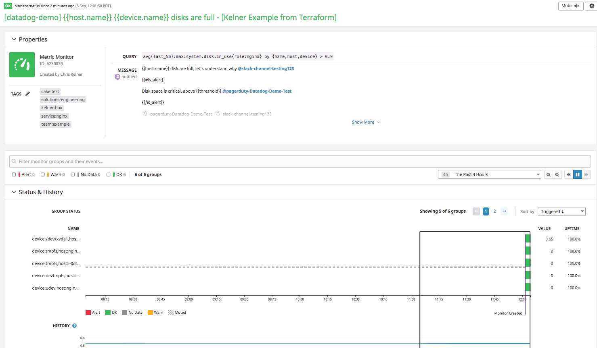

# Datadog Terraform Monitor Example
Example of creating and updating a Datadog monitor using Terraform (for testing purposes).

Monitoring as Code w/ Terraform &amp; Datadog example. This repo will create
monitoring resources using Terraform.

__*This example was setup to test an issue with Terraform when making changes to
thresholds for a monitor that were not being applied and causing a permadiff
issue with TF state.*__

All terraform configuration can be found under the [`/terraform`](/terraform)
directory. Their is no hierarchy for this example, but typically you might
organize your terraform configuration in such a way that it gets broken into
re-usable modules (and potentially modules of modules) for common patterns
within your infrastructure.

__*This repo is only for example purposes.*__

If you are looking for examples that include infrastructure, please be sure to
check out the following:
- https://github.com/ckelner/terraform-datadog
- https://github.com/ckelner/terraform-intro-demo

This repo was carved from work done at Datadog: https://github.com/DataDog/Miscellany/tree/master/create_monitor_terraform

# Noteworthy
- This repo does not use [Terraform
workspaces](https://www.terraform.io/docs/state/workspaces.html); it is a best
practice to use workspaces, this repo is only for example purposes.
- This repo does not use [Terraform remote
state](https://www.terraform.io/docs/state/remote.html); it is a best
practice to use remote state, this repo is only for example purposes.
- For monitoring definitions, see
[`./terraform/monitoring.tf`](./terraform/monitoring.tf)
- Monitors created through the Datadog API and Terraform have a specific syntax
that must include parameters for the critical threshold, e.g.
`avg(last_1h):sum:system.net.bytes_rcvd{host:host0} > 100` -- see more here:
https://www.terraform.io/docs/providers/datadog/r/monitor.html#query and here:
https://docs.datadoghq.com/api/?lang=python#create-a-monitor
  - Omitting or having this below the critical threshold will result in an error
  similar to this: `error updating monitor: API error 400 Bad Request: {"errors":["Critical threshold (0.9) does not match that used in the query (0.0)."]}`

# Use
## Setup
- Checkout this repository using git
- Change into the [`/terraform`](/terraform) directory on the command line
- Update variable values in [`/terraform/variables.tf`](/terraform/variables.tf)
to meet those required by your environment
- Define `DATADOG_API_KEY` and `DATADOG_APP_KEY` in environment variables per
the [Terraform
documentation](https://www.terraform.io/docs/providers/datadog/index.html)

## Init
Run `terraform init` - this will pull down all modules and setup your
local environment to get started with terraform. Output will look similar to the
example below (truncated in places):
```
...
```

# Plan
Run `terraform plan -out=plan.out` - this will provide you with a plan of what
terraform will change (commonly known as a "dry run"). The `-out` flag allows us
to save this plan to a file and use it when making the actual changes later. In
this way we can ensure that any local or remote changes that have occurred
between the time we ran `plan` and `apply` are not accepted.

An example of plan output (truncated in places):
```
...
```

# Apply
Run `terraform apply "plan.out"` to create or update your infrastructure. By
passing `"plan.out"` this will ensure that what you saw in your dry run is what
gets applied to real resources in your provider (Datadog) ignoring any local or
remote changes (which can result in failure if there is a mismatch, this can
help you prevent mistakes or collisions). Example output below w/ truncations:
```

```

You can then take these IDs and open them in the Datadog UI:
- `https://app.datadoghq.com/monitors/<id from out>` replacing `<id from out>`
with the actual id at the end of the TF apply.

Example here:



# Destroy
Run `terraform destroy` to delete all your resources. Ideally you should, in a
best practices scenario, run a `plan -destroy -out=<file.out>` as described in
the [Terraform
docs](https://www.terraform.io/docs/commands/plan.html#destroy) to ensure you
do not destroy anything you intended to keep and then `apply` that plan.

Example output (truncated in places):
```
...
```
